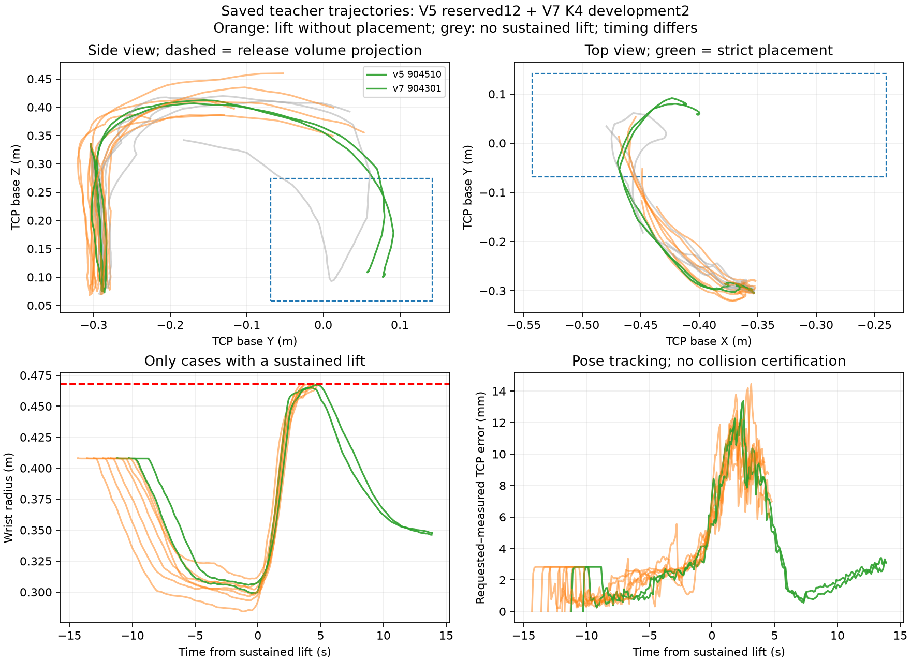

# Teacher carry and reach diagnosis

The failed carries usually move toward the box and follow the requested pose closely. They straighten the elbow to the unchanged 468 mm wrist-radius stop while translating **and rotating**. Excess height contributes in several trials, but height alone does not separate success from failure: some failures are already descending, and the successful trials also approach the reach limit. These recordings do not support an IK branch failure as the main mechanism.

This is a descriptive CPU audit of **12 reserved V5 confirmation trials** and **two V7 K4 development trials**, all ftA1500/NFE1/K4. The groups remain separate; this audit does not change scores or estimate a pooled success rate. Every saved score's seven input hashes was checked before analysis. No inference, simulation, hardware operation, or frozen-source edit was performed.



## What the saved trajectories show

| Set | Physical acquisition | Sustained lift | Carry | Strict placement | Stops |
|---|---:|---:|---:|---:|---|
| V5 confirmation, 12 | 12 | 7 | 6 | 1 | 10 wrist extension; 1 hitbox exit top |
| V7 K4 development, 2 | 2 | 2 | 2 | 1 | 1 wrist extension |

Physical acquisition is the frozen scorer's contact gate; it does not establish the native controller's stronger loaded-grip latch or retained pickup. Five V5 trials fail to sustain a lift. One lifted V5 trial drops its packet. The parallel controller audit identifies empty ascents and absence of played eligible opening after lift; this kinematic audit does not reinterpret unplayed policy predictions as actions.

Across all 14 trials there are **zero logged IK rejects**. Per-trial maximum requested-to-measured TCP errors are 11.8–14.5 mm and 1.58–2.11 degrees; position-error 95th percentiles are 9.27–11.77 mm. The largest measured joint increment is 0.00804 rad per execution sample and maximum joint speeds are 0.833–0.960 rad/s. At wrist stops, elbow angle approaches 0.21 rad continuously. This excludes a large branch jump in the recorded commands and feedback; centimetre-scale tracking lag can still matter near contact or a reach boundary.

The failed retained carries generally move in positive base Y toward the release region. Active terminal plans' raw first-ten-step XY sums point toward that region, rather than systematically away from it. Those sums include predicted future steps that might not play; actual motion and the controller's played-action audit are separate evidence.

## Compare the same stage, rather than the same elapsed second

The table starts at each trial's first **post-acquisition measured wrist radius of 460 mm**, an analytical comparison point, not a new safety threshold.

| Case | At first 460 mm: TCP Z / elbow | About one second later | About two seconds later or stop |
|---|---|---|---|
| V5 904510, placement | 405 mm / 0.436 rad | Z 396 mm; radius 464.7 mm | Z 340 mm; elbow bends back to 0.450 rad; radius 459.4 mm |
| V7 904301, placement | 406 mm / 0.436 rad | Z 384 mm; radius 466.3 mm | Z 331 mm; elbow bends back to 0.411 rad; radius 461.2 mm |
| V7 904302, failed carry | 419 mm / 0.437 rad | Z 417 mm; radius 467.6 mm | Stops after 1.32 s at Z 399 mm and radius 468.0 mm |

Both successful and failed V7 raw plans transition from upward carry to descent. The successful trajectories begin bending the elbow back before crossing the limit. The failed trajectory reaches the boundary before completing that transition. Success margins are small: peak radius is 465.06 mm for V5 904510 and **467.40 mm** for V7 904301. The latter is only 0.60 mm inside the configured limit; this is not a robust hardware margin.

A vertical-only explanation also fails for V5 904501 and 904511. In their final two seconds, TCP height **decreases by 23.6 and 50.8 mm**, respectively, while wrist radius still increases by 18.1 and 12.1 mm. A midpoint nominal-Jacobian decomposition gives translation contributions of −85.5/−110.3 mm and rotation contributions of +103.6/+122.4 mm. Their orientations change by 48.0/43.8 degrees. The summed components reproduce the actual radius change within 6.5e−8 m. This is a coordinate-based differential attribution along measured motion, **not a causal intervention proving that fixing orientation would solve the task**. Rotation is also needed to place the packet.

## Box reach and demonstration context

The box is reachable in this simulated configuration: two recorded cases physically release and settle the packet there. An additional nominal UR3 calculation starts two seconds before each terminal event and interpolates to the observed V5 release TCP. It finds 28 continuous local IK paths: one preserving each starting orientation and one interpolating toward the successful orientation, for each of 14 cases. All sampled solutions stay below 468 mm and within the 0.35 rad consecutive-solution branch bound.

These are **geometric feasibility examples only**. They are not checked for collision freedom, bin-rim clearance, packet fit, payload dynamics, controller hitboxes, timed joint velocity, or hardware calibration. Reaching a TCP point at a different orientation does not prove a valid packet release. No such path was executed or fed to the policy.

The independently audited [ten native Aug22 demonstrations](../data/demonstration_audit.json) have whole-episode peak wrist radii of **404.9–428.8 mm**, peak carry TCP heights of **301.7–358.1 mm**, and maximum measured joint speeds of 0.61–0.82 rad/s. The two simulated successes peak around 407–412 mm in TCP height; lifted failures span about 386–460 mm. Native release TCP X is −378 to −349 mm, whereas the simulated successes release near −412 and −402 mm. Native release orientation also differs from the initial grasp orientation. These are stage-matched distribution differences worth investigating, rather than proof of a single height or registration error: the sessions, initial poses, object placement and phase labels differ. Native phase times use contact/gripper/TCP proxies; canonical episode 5928 additionally has visual pick/place validation.

## Bounded next fix to test

Keep the measured 468 mm stop unchanged. A useful isolated control diagnostic is to distinguish a **verified feasible constraint hold** from an IK failure in the existing optional elbow/command-speed limiter, while giving the policy a bounded opportunity to replan from that held observation. The [completed V6 diagnostic](../../teacher_success_anchor_v6/diagnostic_results/recommendation.md) already shows that its current 25-rejection limit stops after roughly 0.2 s, before a fresh plan can arrive. Preserve native measured safety, explicit current-pose servo commands, grip retention and telemetry; predeclare the wait budget and retain a separate hard IK-failure path. Test this as a new profile, not as an amendment to these results. More waiting does not guarantee the policy will choose a feasible direction.

In parallel, verify the real-to-sim carry pose and release geometry against measured landmarks and demonstration poses. Do not simply raise the reach limit, cap all heights, lock the wrist orientation, or insert an oracle motion toward the box. These recordings justify testing an orientation-aware command boundary and improving pose-distribution fidelity; they do not establish physical calibration or a safe hardware controller.

## Reproduce and inspect

- [Main audit JSON](kinematics_audit.json): all 14 stage poses, q/targets, physical scores, tracking summaries, raw active terminal plans, nominal IK results and raw/source hashes.
- [Critical-turn JSON](critical_turns.json): post-acquisition 460 mm crossing, subsequent states, and active raw plan proposals with scope warnings.
- [Figure PDF](trajectory_comparison.pdf) and [plot samples](plot_samples.json).
- [CPU audit helper](audit_kinematics.py) and [critical-turn helper](critical_turns.py).

Raw authoritative roots on `compute3` are `/home/physicalai/phantom-icra-2027/sim/waffles/runs/teacher_success_anchor_v5/confirmation` and `.../teacher_success_anchor_v7/diagnostic`. The nominal UR3 CB3 kinematics source is `source_teacher_anchor_minimal_v5/phantom/sim/kinematics.py`, SHA256 `120c6caadfeeb9112c1bbb292e76c0f07c76ef4326059756c372ad340ebf73b6`; this is not a serial-number-specific factory calibration. Poses use metres and UR axis-angle rotation vectors, and reported angular changes use SO(3) geodesic distance. Radius uses measured elbow q[2] and the same nominal expression as native safety.

Run the helper in a CPU environment with NumPy and SciPy, selecting a **new output directory**. Existing audit outputs are refused to preserve provenance:

```bash
OMP_NUM_THREADS=1 OPENBLAS_NUM_THREADS=1 CUDA_VISIBLE_DEVICES='' PYTHONDONTWRITEBYTECODE=1 \
  python audit_kinematics.py --out /path/to/new_audit
python critical_turns.py --audit /path/to/new_audit/kinematics_audit.json \
  --out /path/to/new_audit/critical_turns.json
python audit_kinematics.py --out /path/to/new_audit --plot-only
```

The last command additionally requires Matplotlib. The original numeric run completed on compute3; its plotting step lacked Matplotlib, so plots were generated locally from the saved numeric outputs. The current helper separates optional plotting from the numeric audit. Both helpers pass Ruff and Python compilation; the recorded analysis validates score input hashes and the kinematics source pin. Figure traces stop at the first safety stop or FINISH acknowledgement, excluding the post-stop physics tail.
