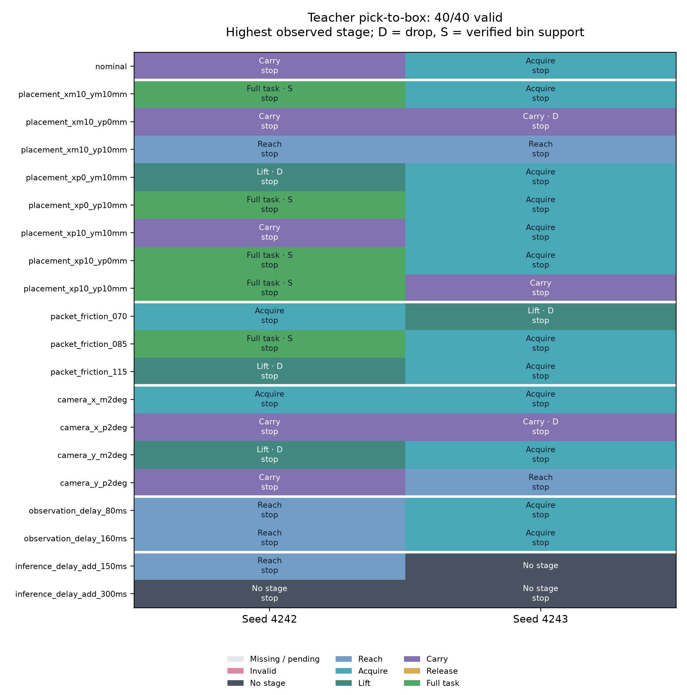

This compact evidence bundle documents **teacher_pick_place_v1: 5 physically verified pick-to-box placements in 40 valid trials (12.5%)**. It contains the final tables, plots, all 40 saved score records, frozen design/provenance, a post-experiment tactile diagnostic, and two unchanged representative reviews. It does not contain the full observation and physics-trace archive needed to recompute every score.

| Outcome | Count |
|---|---:|
| Valid / scheduled | 40 / 40 |
| Acquisition | 31 / 40 |
| Sustained lift | 17 / 40 |
| Carry | 13 / 40 |
| Support-verified full placement | 5 / 40 |
| Drops | 6 / 40 |
| Controller stops | 39 / 40 |
| Nominal full placement | 0 / 2 |

All five placements occurred with seed 4242; seed 4243 achieved none. Each completed placement preceded a later arm-extension stop, and each packet remained inside, unloaded from the robot and supported by the bin at the final sample. Physical placement and normal controller completion are separate outcomes. The descriptive 95% configuration-cluster interval is 5%–22.5%; it describes resampling this fixed condition suite, not laboratory success probability. Seeds4242/4243 were used during development, and measured inference latency varied on shared compute. This establishes no winning placement or checkpoint.

The teacher was `runs/teacher_v5_ftA/teacher_001500.pt` (EMA, NFE1/K4, guidance1, persistent noise, task `waffles`), SHA256 `67c93287123e447b85bf32385660f1a99d6a8b0ad5e995727ac92a680543893e`. The 20 conditions ×2 seeds use a 60 s horizon and the declared `placement_policy_release_v1` extension. The [campaign snapshot](campaign_snapshot.json), SHA256 `325f6144bf605c14800bed56e7eed322632a00f3dba491d26b819abd79049f5c`, retains the exact settings and thresholds. Strict placement requires the ordered physical grasp/lift/carry/release stages, oriented packet containment, low motion and sustained bin support with all-robot unloading. Neither a planner flag nor a release commit establishes success.

- [All 40 cases and video archive index](cases.md), [per-trial CSV](per_trial.csv), [report summary](report_summary.json), and [frozen analyzer summary](analysis_summary.json).
- [Outcome heatmap PNG](outcome_heatmap.png) / [PDF](outcome_heatmap.pdf), and [stage counts PNG](stage_counts.png) / [PDF](stage_counts.pdf).
- [Independent campaign audit](campaign_provenance_audit.md) / [JSON](campaign_provenance_audit.json), [complete local-mirror audit](local_mirror_audit.md) / [JSON](local_mirror_audit.json), and [publication manifest](bundle_manifest.json).
- [Measured startup state](sept4_policy_initial_state.json), [frozen inputs](frozen_inputs.json), [execution plan](plan.json), [completed ledger](progress.json), [experiment source hashes](experiment_source_sha256.json), [source-archive manifest](source_snapshot_manifest.json), [inference-source manifest](inference_source_manifest.json), and [original report provenance](report_manifest.json).
- [Runtime versions](runtime_versions.json), [validation checks](validation_checks.json), and [owned-process cleanup](process_cleanup_audit.json).
- [Post-experiment tactile diagnostic](post_experiment_tactile_diagnostic.md) / [JSON](post_experiment_tactile_diagnostic.json), with its [reproduction helper](audit_gel_force_projection.py).



The published reviews are chosen deterministically, not as a performance ranking:

1. [Nominal seed 4242: failed full task](videos/teacher__nominal__seed4242/policy_review.mp4) ([causal mapping](videos/teacher__nominal__seed4242/policy_review.json)): first nominal trial in frozen order.
2. [X−10/Y−10mm seed 4242: verified placement](videos/teacher__placement_xm10_ym10mm__seed4242/policy_review.mp4) ([causal mapping](videos/teacher__placement_xm10_ym10mm__seed4242/policy_review.json)): first strict full placement in frozen condition/seed order.

Both videos retain their original bytes and actual recorded duration; they are not padded to 60 s. Tactile panels show the exact stored grayscale proxy pixels supplied during inference. They are not calibrated optical tactile predictions. A footer such as `Object: carried` reports the highest stage reached, not necessarily current retention. Use the scene, contact traces and drop markers together.

The frozen contact-area mapper is sensitive to sparse solver manifolds. During a nominal carry, approximately 5.2 N of physical packet contact per pad became 0/0.245 N of gel load when zero-impulse vertices were removed and a two-point fallback was used. Saved inputs exactly reproduce that frozen calculation. The diagnostic identifies a pressure-modeling weakness, not a proven cause of the task outcome; all original scores remain unchanged. Geometry, packet compliance, friction, camera calibration, shear and wrist dynamics also remain estimated, and collision observability is partial. These are simulation results conditional on the declared teacher/controller/environment, not hardware validation.

All 40 full scene-and-tactile reviews, source scene videos, raw observations, contact/tactile histories, numeric traces and runtime records remain at:

```text
compute3:/home/physicalai/phantom-icra-2027/sim/waffles/runs/teacher_pick_place_v1/
```

With access to compute3, retrieve all 40 review videos/mappings and their original verified manifest into a new local directory:

```bash
mkdir -p teacher_pick_place_v1_archive/video_reviews
rsync -a --partial --info=progress2 \
  compute3:/home/physicalai/phantom-icra-2027/sim/waffles/runs/teacher_pick_place_v1/video_reviews/ \
  teacher_pick_place_v1_archive/video_reviews/
```

To retrieve the complete campaign, including large raw observations and tactile arrays, use a filesystem with sufficient free space:

```bash
rsync -a --partial --info=progress2 \
  compute3:/home/physicalai/phantom-icra-2027/sim/waffles/runs/teacher_pick_place_v1/campaign/ \
  teacher_pick_place_v1_archive/campaign/
```

The original metadata retain absolute compute3/research-workspace paths and hashes. The campaign and mirror audits describe those complete archives; they do not imply that all raw inputs are embedded in this compact publication. The publication manifest separately identifies every copied file and its source hash. No source recording, frozen rollout, score, or video was modified to make this bundle. Reproduction and controller details are in [the experiment documentation](../../isaac_teacher_pick_place.md).
