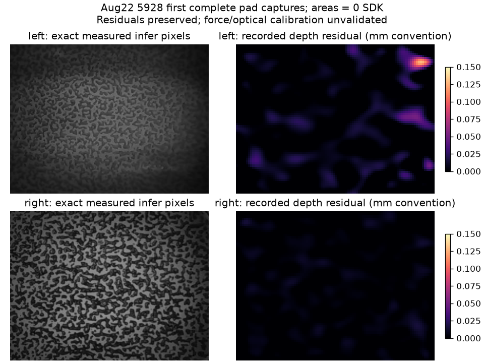

# Aug22 measured tactile baseline

The canonical green-waffle recording `ep_waffles_1787395928_000` contains all ten arrays required by the measured tactile proxy. A new static baseline was extracted from the first complete per-pad captures during its initial no-contact interval. Original recordings and the September baseline remain unchanged.

Remote file: `/home/physicalai/phantom-icra-2027/sim/waffles/runs/teacher_v2_preflights/aug22_5928_no_contact_sensor_baseline.npz` (992,568 bytes). SHA-256: `9f8c2f302c1cb52bdb186bbdcc0dc5c9ed2a4533c9e03670eb1ea1585a225885`. Its adjacent JSON is mirrored as [full provenance](aug22_5928_no_contact_sensor_baseline.json). The [extractor](extract_aug22_baseline.py) refuses existing outputs and opens every source Zarr stream read-only.

| Pad | Capture time after first arm sample | infer / fields / keyframe / wrench / area indices | Recorded area | Recorded wrench Fz, SDK | Depth peak, recorded mm convention |
|---|---:|---|---:|---:|---:|
| Left | 0.305165692 s | 2 / 2 / 0 / 2 / 2 | 0 | −0.909856 | 0.128662 |
| Right | 0.412731332 s | 3 / 2 / 1 / 2 / 2 | 0 | −0.039594 | 0.015854 |

Within each pad, all five samples have exactly the same stored MasterClock timestamp. Every selected sample precedes or equals the frozen cutoff `5582.14535453124` s; the left capture is 107.566 ms older. No clock offset was reapplied. Infer images retain their native `uint8[288,384]`; fields and keyframes retain `float16[72,96,8]` and `float16[144,192,8]`; wrench and area retain their recorded float32 values. Nothing was zeroed, averaged, interpolated or reconstructed.

This is **static sensor calibration from the initial interval**, not a claim that all these keyframes were already available at the earlier robot-start timestamp `5581.74062521616` s. That earlier anchor has no causal left keyframe. A runtime that requires every initial input to precede that exact anchor cannot use a complete Aug22 baseline without explicitly declaring this calibration convention. The proxy holds these frames fixed and adds newly simulated contact; it never advances a recorded tactile sequence.

Both areas remain zero over the first two seconds; their first recorded nonzero values occur at 7.703 s left / 7.639 s right. Initial RGB at 0, 0.5 and 1 s shows the packet on the mat without a hand; the initial measured TCP Z is approximately 0.356 m. These observations support using the initial interval as unloaded evidence. They do not make zero area an independently calibrated contact detector. The sizeable left unloaded depth/force residual is preserved deliberately.

The actual `MeasuredBaselineTactileProxy.synthesize([0,0])` reproduced all ten baseline arrays exactly, including its documented float16-to-float32 conversion; [verification](aug22_tactile_proxy_readback.json) records the proxy source hash. The distributed-force mean multiplied by 110,592 reproduces the recorded wrench force channels within 0.000027 SDK units. This checks internal numerical convention, not force accuracy. SDK wrench/area calibration, torque units, optical deformation and contact-pressure distribution remain uncertain.

Compared with the frozen September baseline, mean absolute infer-pixel differences are 2.411 left / 2.840 right on the 0–255 scale. The new baseline better matches the August recording session; it does not establish that the deformation slopes previously estimated from September data transfer to August. Hold this baseline and the declared mapper fixed across the primary v2 comparison. Keep any later calibration repair in a separately versioned study.
