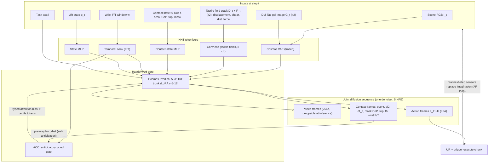
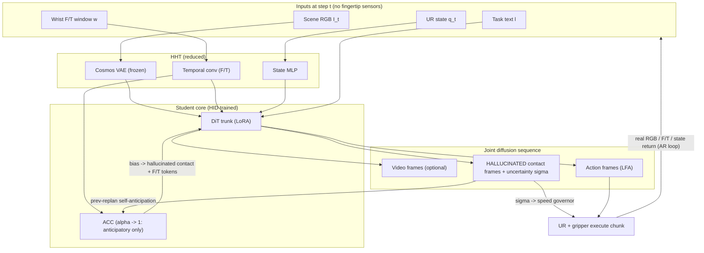

# HapticWAM — Haptic World-Action Model: Full Pipeline (v2)

> Naming: this pipeline was written under the working name **PHANTOM** (Predictive
> Haptic ANTicipation with Occlusion-robust Manipulation) and renamed to
> **HapticWAM** on 2026-09-19. The Python package and the CLI keep the name
> `phantom`; module paths, config keys, checkpoint names and tags are unchanged.

Hardware: UR arm + Robotiq parallel gripper + 2× DM-Tac W2L optical-tactile sensors. Backbone: Cosmos-Predict2.5-2B (`robot/action-cond`). Compute: **single RTX 5090 for training (LoRA, 256–480p) AND deployment** — an 8×H100 (or 8×A100) cloud run is a possible later upgrade (would enable the full-FT Cosmos-Policy recipe), not an assumption — now a config flip: `configs/compute.yaml`.

Module names used throughout:

| Long name | Short name |
|---|---|
| Haptic World-Action Model (working name until 2026-09-19: PHANTOM) | **HapticWAM** |
| Heterogeneous Haptic Tokenizer | **HHT** |
| Anticipatory Contact Coupling | **ACC** |
| Asymmetric generative head with contact-event reparametrization | **ACE head** |
| Latent-frame action injection (Cosmos-Policy-style; replaces the separate IDM) | **LFA** |
| Haptic-Imagination Distillation | **HID** |
| Safety-tuned student (force-safety fine-tune; replaces full RA-HID) | **HID-S** |

---

## 1. Hardware setup

**Manipulator.** UR 6-DoF arm, control and state readout via RTDE. The hardware fork that matters: any e-Series (UR3e/UR5e/…) has a built-in 6-axis force/torque sensor at the tool flange streaming at 500 Hz; a CB3-generation arm only *estimates* TCP force from joint currents (noisier, biased). If the arm is CB3, mount an external wrist F/T (e.g., Robotiq FT-300S, 100 Hz) — ACC depends on a clean wrist wrench. **Confirm the exact arm generation before anything else.**

**Gripper.** Robotiq 2F-85/2F-140 class (position + speed + force command, opening and gOBJ object-detection status feedback at ~100 Hz), or the Daimon DM-Tac G, which ships with W-family fingertips pre-integrated (Modbus RTU/RS485 + Digital I/O).

**Tactile.** Two DM-Tac W2L sensors (Daimon Robotics), one per fingertip. Confirmed spec (official W2L documentation, received directly from Daimon): vision-based optical-tactile, **36×27 mm perceived area, 120 Hz sampling, 640×480 internal camera, 384×288 perceptual resolution** (110,592 points), USB 2.0.

**Sensor reality — RESOLVED (SDK v1.2.10 source + manuals in hand; distilled reference: docs/sensor_sdk.md).** Verified beyond the API table below: every field getter returns `(fid, data)` and images return `(fid, DMTacImage)` (pixels at `.img`, uint8 grayscale); **all `SensorOptions` channel enables default to False** (the manual wrongly says True — the driver sets them explicitly); `setEnableFlags` has no force argument; `getForce` units are documented (Fx,Fy,Fz in N; Mx,My,Mz in 1e-2 N·m) — only the distributed-force units remain a bench item; **offline field recompute from raw frames is a documented vendor path** (`process()` + `setBaseFrame` + `gen_feat_hdf5.py`), so the recording plan archives raw grayscale (~37 MB/s/sensor) and derives fields offline; fields are computed host-side (USB carries ~4.5 MB/s/sensor; 120 Hz needs a ≥RTX4060-class GPU on the recording host); the vendor ships a `TactileSlipDetector` reference (threshold 0.35) as a baseline for our derived slip; **the W2 pad's force ceiling is 30 N total** — the Robotiq (235 N max) is force-clamped in software; the vendor CAD pack includes ready **Robotiq 2F finger adapters for the W2L** (no custom mount). The full API surface (per sensor, `Sensor(SensorOptions(dev_id))`):

| SDK call | Returns | Shape / dtype |
|---|---|---|
| `getRawImg()` | raw camera image | uint8, 640×480 (channels ⚠) |
| `getInferImg()` | processed/inferred gel image | uint8 (size ⚠, likely 640×480) |
| `getBaseFrame()` | reference (no-contact) frame | — |
| `getDeformation2D()` | tangential (in-plane) deformation field | (H, W, 2) float32 |
| `getDepth()` | normal deformation / indentation map | (H, W) float32 |
| `getShear()` | shear field | (H, W, 2) float32 |
| `getDistributeForce()` | **per-pixel 3-axis force distribution** $f_x, f_y, f_z$ | (H, W) float32 × 3 |
| `getForce()` | **resultant 6-axis wrench** | (1, 6) float32 (units ⚠) |
| `getContactArea()` | contact area | float, mm² |

with (H, W) = the 384×288 perceptual grid (numpy row/col ordering ⚠ — bench). Two consequences: (i) **the per-pixel force fields v2 dismissed as marketing claims are real, documented outputs** (`getDistributeForce`), and the 6-axis wrench and contact area are native calls, not inferences; (ii) still **not** in the API: contact mask, CoP, slip, stiffness — those remain ours to derive. Stiffness stays dropped.

**Design rule: derive only what the SDK doesn't ship.** Higher-level contact quantities are computed by us, deterministically — now from richer native inputs:

- contact mask $M_t$: threshold on depth ($|d_z| > \tau$) or on $|f_z|$; cross-checked against native `getContactArea` ($A_t$)
- center of pressure $p_t$: **$f_z$-weighted centroid** over the distributed-force field (upgraded from contact-weighted — force-weighted is the physically correct CoP)
- slip score $s_t$: tangential-flow statistic (mean $|\Delta d_{xy}|/\Delta t$ over the contact region) **and/or friction-cone proximity $\lVert(f_x,f_y)\rVert / f_z$** — the calibrated tangential force makes a physically grounded stick–slip detector possible, not just a flow heuristic
- event labels (for ACC/ACE training): onset = $M\,0\!\to\!1$, release = $1\!\to\!0$, slip = $s_t > \tau_s$ while in contact, hold = contact ∧ ¬slip, none = otherwise

The zero-manual-labeling story is intact — and no longer depends on anything unverified. The tactile tensor definition is updated, architecture unchanged (still one tensor, one encoder): $D_t \in \mathbb{R}^{384\times288\times3}$ = 3D displacement (`getDeformation2D` xy ‖ `getDepth` z), plus the **native force-field stack $F_t \in \mathbb{R}^{384\times288\times5}$** (`getShear` 2ch ‖ `getDistributeForce` 3ch), channel-stacked into the same conv encoder ($[D_t \Vert F_t]$, 8 input channels). Displacement-only vs. +force-channels becomes an ablation instead of an assumption.

**Recording plan per timestep (per fingertip unless noted; ⚠ = verify on the physical unit day 1):**

| Modality | Symbol | SDK call | Shape / dtype | Rate |
|---|---|---|---|---|
| Gel image (processed) | $G_t$ | `getInferImg` | uint8, ~640×480 (channels ⚠) | up to 120 Hz ⚠ |
| Raw camera image (optional archive) | $G^{raw}_t$ | `getRawImg` | uint8, 640×480 | up to 120 Hz ⚠ |
| 3D displacement field | $D_t$ | `getDeformation2D` (xy) + `getDepth` (z) | 384×288×3 float32 | 120 Hz |
| Force-field stack | $F_t$ | `getShear` (2) + `getDistributeForce` (3) | 384×288×5 float32 | 120 Hz |
| Resultant 6-axis wrench | $f_t$ | `getForce` | (1, 6) float32 (units ⚠) | 120 Hz |
| Contact area | $A_t$ | `getContactArea` | 1 float32, mm² | 120 Hz |
| Derived: mask, CoP, slip | $M_t, p_t, s_t$ | computed from $D_t, F_t, A_t$ | — | field rate |
| Wrist F/T (arm) | $w_t$ | RTDE | 6 float32 | 500 Hz (e-Series) / 100 Hz (FT-300S) |
| UR state | $q_t$ | RTDE | 6 joint pos + 6 vel + TCP pose + gripper opening/force | 125–500 Hz |
| Scene RGB (RealSense D435/D455) | $I_t$ | — | 640×480×3 uint8 | 30 Hz |
| Wrist RGB (optional) | $I^w_t$ | — | 640×480×3 uint8 | 30 Hz |
| Action (teleop command) | $a_t$ | — | 7 float32 (Δ-EE pose 6 + gripper 1) | 10–30 Hz |
| Language instruction | $l$ | — | text | per episode |

Everything is timestamped on one clock (RTDE master); high-rate streams stored native and windowed/interpolated to the model tick at load time. **Storage reality check:** the full 8-channel field stack at 384×288 float32 is ~3.5 MB/frame → **~425 MB/s per sensor at 120 Hz** (fields are computed host-side from the camera stream, so this is a disk/CPU constraint, not USB). Recording plan: fields **downsampled** (e.g., 96×72) at full 120 Hz + full-resolution keyframes at reduced rate, or float16 on disk; if the SDK's `getBaseFrame`-referenced inference can be replayed offline from recorded raw images, archive $G^{raw}_t$ and recompute fields offline (bench item). **Day-1 bench (reduced scope — the API enumeration is done):** confirm getForce/getDistributeForce units (N?), image channel counts and true per-stream rates, numpy (H, W) ordering, sustained multi-stream throughput, and offline-recompute feasibility.

---

## 2. Which modalities HapticWAM uses

**Consume (input) — the full native SDK surface.** $I_t$ (+ $I^w_t$), $l$, $q_t$; from each DM-Tac W2L: $G_t$, the displacement field $D_t$, the force-field stack $F_t$, the 6-axis wrench $f_t$, native contact area $A_t$, plus the derived $(M_t, p_t, s_t)$; and the wrist F/T window $w_{t-k:t}$. **Yes, the wrist F/T goes into the teacher too**: it is (i) the earliest physical precursor of contact — the wrench rises before the fingertip feels anything, exactly what ACC needs; (ii) free on the robot; (iii) the one contact-bearing signal that *survives distillation* — and giving it to the teacher makes the teacher-vs-student comparison isolate exactly the tactile removal.

**Generate (output) — contact mechanics, not tactile pixels.** Next-step scene-RGB latent $\hat I_{t+1}$ (coarse, guidance only, droppable at inference); the structured contact package $\hat c_{t+1} = (\hat e_{t+1}, \Delta\hat D_{t+1}, \Delta\hat f^z_{t+1}, \hat M_{t+1}, \hat p_{t+1}, \hat s_{t+1}, \hat f_{t+1})$ where $\hat e$ is the contact-event token, $\Delta\hat D$ is a downsampled displacement-delta field (e.g., 48×36×3), and $\Delta\hat f^z$ is the downsampled **calibrated normal-force delta** (48×36×1, from the native distributed-force channel — the fragility-relevant quantity, now generated in force units rather than a deformation proxy); next wrist F/T $\hat w_{t+1}$; and the action chunk $a_{t:t+H}$. The gel image is **not** generated — its mechanical content is already in $(D, F, M, p, s, f)$, and generating tactile pixels is the "tactile-as-image fidelity tax" HapticWAM is positioned against. The full-resolution force-field stack $F_t$ is likewise consumed but not generated at full resolution — $\Delta\hat f^z$ carries its safety-critical content.

---

## 3. CASA and its replacement: ACC

### CASA in brief

Dream-Tac's Contact-Aware Self-Attention computes a gate from *observed* frame-to-frame tactile change,

$$g_t^{\text{react}} = \sigma\big(\psi(\lVert x_t - x_{t-1}\rVert)\big),$$

and adds it as an attention bias toward tactile tokens, amplifying touch only when contact dynamics are already salient.

### CASA's limitations

1. **Reactive by construction** — a function of a tactile *difference* cannot rise before the tactile signal moves; for transients lasting tens of ms, the gate opens after the informative part is half over.
2. **Ignores leading indicators** — wrist wrench, visual approach geometry, and the intended action all foreshadow contact; CASA reads none of them.
3. **Phase-blind** — one scalar cannot distinguish onset / slip / release, which demand opposite responses.
4. **Unsupervised & untyped** — a fixed function of observed change; never trained to be predictive.
5. **Dies with the sensor** — after distillation there is no tactile stream to differentiate, so CASA cannot exist in a sensor-free student.

### ACC — Anticipatory Contact Coupling

**Design principle (WAM-native).** HapticWAM generates the next-step contact package every replan, so anticipation requires no extra annotation: *the model's own generated future contact is the anticipatory signal.* One fix over v1: to avoid circularity (the gate cannot consume an output of the very forward pass it biases), ACC reads the **previous replan's** prediction:

$$e_t = \phi\big(\big[\,w_{t-k:t}\;\Vert\; z^{\text{vis}}_t \;\Vert\; a^{\text{intent}}_t \;\Vert\; \hat c_{t+1|t-1}\,\big]\big)$$

- $w_{t-k:t}$: wrist F/T window (TCN-encoded) — earliest physical precursor;
- $z^{\text{vis}}_t$: approach cues pooled from the DiT's own visual tokens (looming / gripper–object proximity);
- $a^{\text{intent}}_t$: embedding of the previously committed action chunk;
- $\hat c_{t+1|t-1}$: the contact package generated at the previous replan for the current horizon.

The one-step staleness is stated and acceptable: the gate still leads the *physical* transient, which is exactly what the lead-time plot measures.

**Gate and event typing:**

$$\hat g_t = \sigma(W_g\, e_t), \qquad p^{\text{evt}}_t = \mathrm{softmax}(W_e\, e_t) \;\text{ over } \{\text{none, onset, hold, slip, release}\}.$$

**Injection into attention** (CASA-style routing — precedented in this exact architecture by Dream-Tac's bias — but early and typed): for key tokens $h$ in the haptic group,

$$s_{q,h} \;\leftarrow\; s_{q,h} + \lambda\,\beta(p^{\text{evt}}_t)\,\hat g_t,$$

with $\beta(\cdot)$ up-weighting onset/slip/release. **The haptic group is defined per stage: in the teacher, the tactile tokens (field stack $[D\Vert F]$ + contact-state + gel); in the student — where no tactile tokens exist — the hallucinated contact-package frames and the wrist-F/T tokens.** The same $(\hat g_t, p^{\text{evt}}_t)$ also condition the action frames (LFA), so the chunk is shaped for the contact *before* it happens.

**Training targets — automatic, no manual tags.** Event labels come from the derived channels of §1 (mask transitions, slip score) — zero human labeling, and now zero dependence on undocumented SDK outputs. The generation loss on $\hat c_{t+1}$ (the standard WAM next-step objective) is what teaches anticipation; an optional auxiliary $\mathrm{BCE}(\hat g_t, \mathbb 1[\text{contact in }(t, t+\Delta)])$ uses the same auto-derived mask.

**CASA as a special case.** Keep a reactive term during training and fuse by a learned confidence:

$$\hat g_t = \alpha_t\,\hat g^{\text{ant}}_t + (1-\alpha_t)\,\hat g^{\text{react}}_t.$$

$\alpha_t \equiv 0$ recovers CASA exactly; at deployment without fingertip sensors, $\alpha_t \to 1$ and the gate runs purely on leading signals + the model's own imagination.

**Why ACC is superior:** it fires *before* the transient (predictive, not reactive); it is *typed* (onset vs. slip vs. release get different treatment); it is *supervised for free* by the WAM's own next-step objective; it strictly *contains CASA* as its $\alpha=0$ limit; and it *survives sensor removal*, which CASA structurally cannot.

---

## 4. ACE head — Asymmetric generative head with contact-event reparametrization

**Why it is needed.** Three pressures collide: (i) real-time control means a finite denoising budget — on our stack, ~5 NFE per replan (Cosmos-Policy's operating point); (ii) fragile-object safety needs *calibrated force* prediction, not plausible tactile pixels; (iii) the tactile signal is mostly stasis punctuated by rare transients, so modeling it densely wastes capacity on nothing. The ACE head spends compute asymmetrically across output groups and moves tactile generation out of pixel space into event-conditioned mechanics.

**Contact-event reparametrization.** Factor the future contact state as

$$p(c_{t+1}\mid \cdot) \;\approx\; p(e_{t+1}\mid \cdot)\; \cdot\; p(\Delta x_{t+1}\mid e_{t+1}, \cdot), \qquad \Delta x = (\Delta D, M, p, s, f),$$

and reconstruct $x_{t+1} = x_t \oplus \Delta x_{t+1}$. During `none` the model learns $\Delta x \approx 0$ at near-zero cost; during onset/slip/release the event token conditions a focused delta prediction. The event vocabulary is the same one ACC uses — one contact ontology across the whole model, all labels auto-derived (§1).

**How asymmetry is realized in a joint-diffusion backbone** (v1's per-branch NFE doesn't apply cleanly when one denoiser handles the whole sequence; this is the honest version):

| Group | Output | Asymmetry lever | Loss weight | Role |
|---|---|---|---|---|
| Video | $\hat I_{t+1}$ latent (scene RGB) | low resolution (256p), few frames, **droppable at inference** via structured attention mask (Fast-WAM-style: action/contact frames never attend to future-video frames) | small $\lambda_v$ | coarse guidance, not a fidelity target |
| Contact | $\hat e_{t+1}$, $\Delta\hat x_{t+1}$, $\hat w_{t+1}$ | always denoised, every replan | large $\lambda_c$ | the physics that safety depends on |
| Action (LFA) | $a_{t:t+H}$ | always denoised, every replan | large $\lambda_a$ | what actually executes |

Total objective:

$$\mathcal L = \lambda_a \mathcal L_{\text{act}} + \lambda_v \mathcal L_{\text{vid}} + \lambda_c\big(\mathcal L_{\text{evt}} + \mathcal L_{\Delta}\big) + \lambda_w \mathcal L_{\text{F/T}} + \mathcal L_{\text{ACC}}.$$

**Heteroscedastic contact prediction, wired to control.** The contact group also predicts a per-output variance $\sigma$; the regression term becomes $d/\sigma^2 + \log\sigma^2$. At deployment $\sigma$ **drives a speed governor** — approach velocity is scaled by $g(\sigma)$ — so the student slows down exactly where its own hallucination is unreliable. (In v1 the uncertainty was predicted but consumed by nothing.)

**Use with this specific setup:** $\Delta\hat f^z$ carries the fragility budget directly in calibrated force units (native `getDistributeForce` channel; $\Delta\hat D$'s z-channel is the deformation backup if units stay unverified), $\Delta\hat D$'s xy-channels plus the shear channels of $F_t$ carry directional slip precursors, $\hat M/\hat p$ carry contact migration (roll onset), $\hat s$ is directly comparable to our derived slip score — now grounded in the friction-cone ratio $\lVert(f_x,f_y)\rVert/f_z$, not just flow — $\hat w_{t+1}$ closes the loop with the wrist F/T that ACC reads, and the gel image is deliberately absent from the outputs.

---

## 5. HID and HID-S — distillation that removes the fingertip sensors

### HID — Haptic-Imagination Distillation

Teacher: full HapticWAM (all DM-Tac streams + wrist F/T + vision + proprio). Student: identical architecture with the DM-Tac input path removed (vision + proprio + wrist F/T). The student keeps the ACE head — it still *generates* the contact package; it just can no longer *feel* it. Distill the teacher's imagined future, not a single token:

$$\mathcal L_{\text{HID}} = \sum_{\tau=1}^{T} w_\tau\Big[\, d\big(\hat c^{\,S}_{t+\tau},\; \mathrm{sg}\,\hat c^{\,T}_{t+\tau}\big) \;+\; \mathrm{CE}\big(\hat e^{\,S}_{t+\tau},\; \mathrm{sg}\,\hat e^{\,T}_{t+\tau}\big)\Big], \qquad w_\tau = s_\tau \cdot c_\tau,$$

where $s_\tau$ (event saliency, from the teacher's predicted events) concentrates the loss on onset/slip/release, and $c_\tau$ (teacher confidence, from the teacher's predictive variance) down-weights steps where the teacher is guessing. Behavior matching so decisions transfer, not just features:

$$\mathcal L_{\text{beh}} = D\big(\pi^S \,\Vert\, \mathrm{sg}\,\pi^T\big)$$

— **action distribution only. The value-matching term of v1 is deleted: no value head is trained anywhere in this pipeline, so $V^T$ did not exist.** An optional feature-alignment term $\mathcal L_{\text{hid}} + \mathcal L_{\text{mot}}$ (Efficient-WAM-style cosine alignment of hidden states and their temporal deltas) is kept as a single ablation row.

**On-policy correction — mandatory, new in v2.** Offline-only distillation drifts: the sensor-free student visits contact states the teacher's data never covered (the known failure mode of naive privileged-information distillation — PTLD and World-Model Self-Distillation both report it). After offline HID: **2 DAgger rounds** — ~50 student rollouts per task, teacher relabels (the teacher can, since the rig still wears the sensors during training), retrain, repeat.

### HID-S — safety fine-tune (what remains of RA-HID)

v1's full RA-HID is **cut to future work**: its reward machinery had three unresolved holes (an untrained value head; a grounding term that only exists on-dataset yet was applied to imagined counterfactual rollouts; and reward-from-imagination model-exploitation risk). What survives is the one term that is well-defined and cheap — an optional fine-tune of the distilled student with the force-safety penalty:

$$r_t \;=\; -\lambda_F \max\big(0,\; \lVert \hat f^z_{t}\rVert_\infty - \tau_{\text{obj}}\big),$$

on the **calibrated normal-force field** (native `getDistributeForce` z-channel; fall back to $\hat D^z$ peak deformation if force units stay unverified after the bench), with $\tau_{\text{obj}}$ auto-calibrated per object/task as the 90–95th percentile of peak normal force over *successful* teacher episodes — the dataset defines "gentle enough," no human sets a number. Exponentiated-advantage weighted regression with a KL leash to the post-HID student. Reported as one extra row ("safety-tuned student") if time allows; the paper stands without it.

---

## 6. HapticWAM — full architecture and data workflow

### a) Backbone choice

**`nvidia/Cosmos-Predict2.5-2B`, starting from the `robot/action-cond` post-train (256p, 4 fps, image + action sequence → future frames).** This decision is now research-backed, not preference:

- **14B is out on a single RTX 5090 (32 GB):** 56.4 GB for Video2World inference alone; 48.9 GB even for Text2Image. And NVIDIA's own benchmark scores post-trained 2B ≈ 14B (~0.768), so the quality premium is modest.
- **2B fits — at reduced resolution only.** LoRA fine-tuning is ~20 GB at low resolution but ≥80 GB at 432×768 (activation memory dominates); 720p Video2World inference is 32.5 GB — over budget. Operating point: **256–480p, short frame windows, batch 1, LoRA r=8–16, bf16** (the model is bf16-only). Full fine-tuning (~50 GB) is off the table, which is exactly why the LoRA plan is right.
- License: NVIDIA Open Model License — derivatives (our LoRA + heads) explicitly allowed. The released Cosmos-Policy *checkpoints* are noncommercial (NSCLv1): we use the recipe, not the weights.
- Environment (Blackwell/sm_120): PyTorch ≥2.7 cu128; flash-attention needs a source build for sm_120 (or SDPA fallback); Docker recommended. One day of tax, budgeted.
- Do **not** use `auto/multiview` (AV domain) or `robot/multiview-agibot` (humanoid multi-cam rig — wrong embodiment).

### b) LFA — action injection (the main architecture change vs. v1)

v1 trained a separate 100–300 M "IDM" action DiT. **Deleted.** Both Cosmos-Policy and Dream-Tac — on this exact backbone — inject actions the same way: **normalized actions, proprio, and auxiliary quantities are duplicated to latent-frame dimensions and inserted as extra latent frames in the diffusion sequence; the one rectified-flow DiT denoises video frames, contact frames, and action frames jointly.** No new action architecture to invent or validate, ~200 M fewer trainable parameters on a 32 GB card, and the structured contact package rides the same mechanism (contact mechanics as latent frames, exactly like Cosmos-Policy's value frames). Our novelty budget stays where it belongs: HHT, ACC, HID.

### c) Input tokenization (HHT)

| Input | Encoder | Trained? | Notes |
|---|---|---|---|
| Scene RGB $I_t$ (+ wrist cam) | Cosmos VAE | **frozen** | native backbone path |
| Gel image $G_t$ (`getInferImg`, ×2 fingers) | Cosmos VAE | **frozen** | tactile appearance, backbone-compatible |
| Tactile field stack $[D_t \Vert F_t]$ ∈ 384×288×8 (×2) | small conv encoder (~5 M) | **trained** (contact-play pretrained) | one tensor, one encoder (architecture unchanged): displacement 3ch (`getDeformation2D`+`getDepth`) ‖ shear 2ch (`getShear`) ‖ distributed force 3ch (`getDistributeForce`); force channels ablatable |
| Contact state $(f_t\ 6\text{-axis}, A_t, p_t, s_t, M_t\text{-summary})$ | contact-state MLP → 1–2 tokens (~1 M) | **trained** | native wrench + area, derived CoP/slip per §1 |
| Wrist F/T $w_{t-k:t}$ | temporal conv (TCN, ~2 M) | **trained** | high-rate window, feeds ACC too |
| UR state $q_t$ | state MLP (~1 M) | **trained** | joints + TCP + gripper |
| Text $l$ | Cosmos-Reason1 encoder | **frozen** (CPU-offloaded) | task conditioning |

### d) Full model map — what is frozen, what is trained

| Component | Size | Status |
|---|---|---|
| Cosmos-Predict2.5-2B DiT trunk | 2.06 B | frozen + **LoRA r=8–16 (~30–60 M trainable)** |
| Cosmos VAE / tokenizer | — | frozen |
| Cosmos-Reason1 text encoder | — | frozen, CPU-offloaded |
| HHT new encoders (conv + 3 MLP/TCN) | ~10 M | trained (tactile-field encoder contact-play-pretrained first; 8-ch input $[D_t \Vert F_t]$) |
| ACC gate $\phi, W_g, W_e$ | ~2 M | trained |
| ACE contact-frame embedder/decoder | ~10–20 M | trained |
| LFA action-frame embed/decode | ~2 M | trained |
| **Total trainable** | **~60–120 M** | vs ~400 M+ in v1 — fits one 5090, trains in days |

### e) Generation outputs and the runtime loop

Closed loop is **receding-horizon chunks, not per-tick** (~5 NFE ≈ seconds per replan on this backbone — the Cosmos-Policy operating point; v1's per-tick loop was not achievable). Per replan: **(1)** encode current obs (HHT); **(2)** ACC fuses leading signals with the previous replan's $\hat c$ into the typed gate; **(3)** one joint denoise (5 NFE) produces the contact package $\hat c$, next wrist F/T $\hat w$, the action chunk $a_{t:t+H}$ ($H$=16–50), and optionally the video frames (droppable via the ACE attention mask); **(4)** the arm executes the chunk at control rate while the speed governor scales velocity by the contact-group $\sigma$; **(5)** real captured sensors replace the imagined ones as new context (AR grounding — errors cannot compound in imagination); repeat. Training = next-step prediction on all generated groups against recorded values (the plain WAM objective) + action loss + the auto-derived ACC auxiliaries; **no manual event tags exist anywhere in the pipeline.**

### Stage 1 diagram (teacher HapticWAM)

### f) Stage 2 — the distilled student at deployment

The DM-Tac input path (gel image, tactile field stack $[D\Vert F]$, contact-state tokens) is deleted. The student keeps: RGB, text, UR state, wrist F/T. Crucially it **keeps the full ACE head** — it still generates the contact package every replan, now as a *hallucination* trained by HID (and optionally HID-S). ACC runs at $\alpha \to 1$, and its attention bias targets the **hallucinated contact frames + wrist-F/T tokens** (the haptic group of the student). The speed governor runs on the student's own $\sigma$. So at deployment the robot anticipates and pre-shapes for contact it can no longer feel — and slows down where its hallucination admits uncertainty.

---

## 7. Data requirements

Anchor: Dream-Tac fine-tuned Cosmos-Predict2-2B with **100 episodes/task** (on 8×H100, full fine-tune; we LoRA on one 5090, so lean on pretraining and co-training harder). Two facts soften the bill:

- **Tactile frames ≫ episodes.** At the confirmed 120 Hz, one 20 s episode yields 2,400 field frames per finger; 100 episodes ≈ ~480k frames — encoder sample count is not the bottleneck. The bottleneck is *task-level action diversity*.
- **Encoders decouple from demos.** Pretrain the tactile-field encoder self-supervised on **2–4 hours of unscripted "contact play"** — and the 8-channel stack adds a free objective: predict the force channels from the displacement channels (cross-channel prediction with native supervision) (random pokes, grasps, slides over many objects — no task, no teleop skill, collectable in an afternoon) with masked-reconstruction + cross-channel prediction objectives.

**Budget (5 tasks):**
- **Teleop: 150 episodes/task × 5 = 750** (~20–40 s each), all tasks co-trained.
- **+20–30 deliberate failure/near-limit episodes** per fragile task (controlled over-squeeze on sacrificial objects, induced slips) — HID-S's auto-threshold and the slip ontology are only as informative as the boundary examples in the data.
- **DAgger: 2 rounds × ~50 student rollouts/task**, teacher relabels. Not optional.
- Optional sim augmentation (Isaac Lab visuo-tactile) only if time allows; the paper does not depend on it.

---

## 8. Experiments

### Research questions

| RQ | Claim | Headline evidence |
|---|---|---|
| RQ1 | Structured tactile (HHT) > tactile-as-image | HapticWAM beats its own VAE-only-tactile variant, largest gap on force-safety/slip tasks |
| RQ2 | ACC > reactive gating | Beats the in-framework CASA variant on transient events, with the gate-lead-time plot (fires *before* physical onset) |
| RQ3 | HID removes the sensor cheaply — **the headline** | Student recovers most of the teacher-over-vision-only gap, *especially under occlusion*; the no-distillation control shows the gain is distillation, not just wrist F/T |

(v1's RQ4 — dynamic interception — is cut: a receding-horizon diffusion WAM replanning every few seconds cannot intercept, and it was the claim least connected to the distillation story.)

### Comparative systems — all five in-framework (no external reimplementations)

1. **Vision-only WAM** — same backbone, no tactile ever: lower bound.
2. **Teacher HapticWAM** — full tactile at test: upper bound.
3. **HID student (ours)** — vision + proprio + wrist F/T, no fingertip sensors.
4. **No-distillation control** — *identical inputs to (3), trained from scratch without HID.* **The critical control**: without it, reviewers attribute everything to the wrist F/T.
5. **Drop-tactile-add-nothing student** — distilled, but vision + proprio only: isolates the value of the F/T substitution.

CASA and tactile-as-image are built as **variants inside our framework** (swap the gate / swap HHT for VAE-only) — controlled comparisons for RQ1/RQ2. Dream-Tac, VT-WAM, π0 are cited and argued, not reimplemented: reproducing three external systems on one rig is months, and in-framework variants are the *more* controlled comparison anyway. (+ optional row: HID-S safety-tuned student.)

### Ablations

- **HHT (RQ1):** tactile-as-image (VAE only) vs. full HHT; progressive build-up (gel → +displacement field → **+force channels (shear + distributed force)** → +contact-state → +wrist F/T); wrist F/T on/off as its own column. The displacement-vs-+force step is the new, directly reviewer-facing cut: does *calibrated mechanics* beat *geometry alone*?
- **ACC (RQ2):** $\alpha\!=\!0$ (=CASA) vs. $\alpha\!=\!1$ vs. learned fusion; event head off; leave-one-out over leading signals (F/T / visual / intent / self-anticipation); **lead-time money plot** — distribution of (gate-crossing − true onset) for ACC vs. CASA, plus event F1.
- **ACE:** video frames on vs. off at inference (guidance or tax — report honestly, this is also the latency ablation); structured contact vs. generating the tactile latent instead (the fallback bet on the reparametrization).
- **HID (RQ3):** trajectory vs. single-token distillation; uniform vs. saliency vs. saliency+confidence weighting; feature-alignment term on/off; **DAgger on/off**; student with vs. without wrist F/T; speed governor on/off.

All ablations run on 2 tasks, not the full suite (~8 configs × 2 tasks).

### Protocol and metrics

Real robot mandatory; sim only for augmentation. Every task run **teacher vs. student** (retention is a paired measurement). Fragility instrumented (pre-scored eggshells, force film), **≥3 seeds, 20 physical trials/task/condition**. Task suite (5): fragile grasp · textured/slippery grasp-and-place · insertion · surface wipe with force regulation · in-hand regrasp — **two of them additionally run under visual occlusion (curtain/lights)**, the regime where the tactile teacher's advantage is largest and the student's hallucination is most tested. Full matrix: 5 systems × 5 tasks (+2 occluded variants) × 20 × 3 ≈ 2,100 trials + ~960 ablation trials.

Metrics: success %, breakage/damage %, peak force + threshold violations, slip-recovery rate, ACC lead time (ms) + event F1, latency / control Hz / NFE — and the two headline numbers:

$$\textbf{recovery ratio} = \frac{\text{student} - \text{vision-only}}{\text{teacher} - \text{vision-only}}, \qquad \textbf{retention} = \frac{\text{student}}{\text{teacher}},$$

each reported overall **and under occlusion**.

---

## Verification checklist before building (blockers, not pre-submission items)

1. **DM-Tac W2L SDK bench — reduced further (SDK source + manuals fully read 2026-07-06; docs/sensor_sdk.md).** `getForce` units CONFIRMED (N / 1e-2 N·m → config 1.0/0.01); raw image confirmed grayscale; offline replay confirmed documented (vendor `gen_feat_hdf5.py`). Remaining half-day items: (a) `getDistributeForce` units only — decides whether HID-S runs on calibrated force or the deformation fallback; (b) `getInferImg` size/channels + true per-stream rates under concurrent dual-sensor polling; (c) numpy (H, W) ordering of the 384×288 grid; (d) sustained multi-stream disk throughput; (e) offline-recompute bit-parity on the rig (then flip `recording.archive_raw_img` + `offline_recompute_ok`).
2. **Confirm the arm generation** (likely a UR5-class arm; read the model plate): e-Series (built-in 500 Hz wrist F/T) vs CB3 (order a Robotiq FT-300S now — ACC depends on it).
3. **5090 smoke test**: PyTorch ≥2.7 cu128 (Docker recommended), flash-attn source-built for sm_120 or SDPA fallback; load `Cosmos-Predict2.5-2B/robot/action-cond`, run one LoRA step at target resolution, **measure the actual VRAM footprint** (official numbers span 20–80 GB purely on resolution/sequence length).
4. Check Hugging Face for a manipulation-domain Cosmos-Predict2.5 post-train newer than `robot/action-cond`/`robot/policy` at implementation time.
5. ~~Settle the model name~~ — **done 2026-09-19**: the project is **HapticWAM** (Haptic World-Action Model). The working name PHANTOM is retired from prose; the Python package and CLI keep `phantom`. ("WHAM" was off the table — Microsoft collision.)
